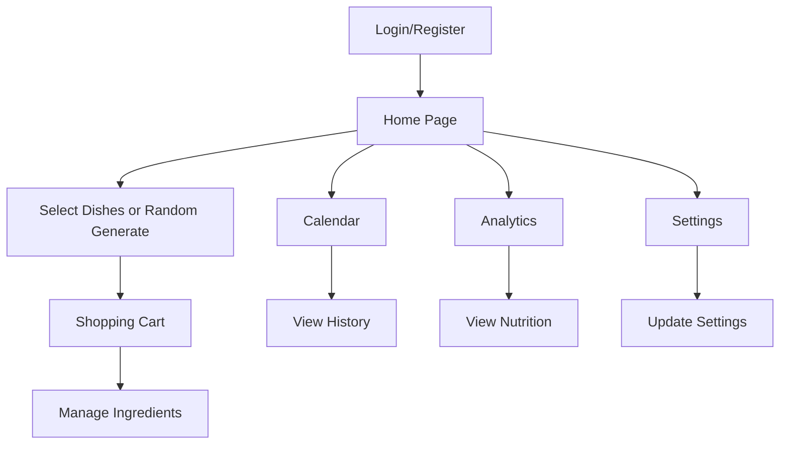

## 1. Product Overview
今天吃什么是一个智能用餐推荐网站，帮助用户解决"今天吃什么"的日常困扰。用户可以设置用餐人数，从预设菜单中选择菜品或让系统随机生成荤素搭配的菜单，自动生成购物清单，查看营养分析，追踪用餐历史。

网站通过智能推荐和食材管理，简化用户的用餐决策过程，提供营养均衡的饮食建议。

## 2. Core Features

### 2.1 User Roles
| Role | Registration Method | Core Permissions |
|------|---------------------|------------------|
| Normal User | Email registration via Supabase | Browse menu, select dishes, generate random menu, manage shopping cart, view calendar, nutrition analysis |

### 2.2 Feature Module
网站包含以下核心页面：
1. **登录注册页**：用户登录、注册功能
2. **首页**：菜单浏览、菜品选择、随机生成菜单
3. **购物车页**：食材清单管理、添加删除食材
4. **日历页**：历史用餐记录查看
5. **分析页**：营养摄入统计、热量分析
6. **设置页**：用户设置、用餐人数设置、登出

### 2.3 Page Details
| Page Name | Module Name | Feature description |
|-----------|-------------|---------------------|
| Login/Register | Login form | Input email and password to login |
| Login/Register | Register form | Create new account with email and password |
| Home | Menu display | Show all dishes with images, names, and basic info |
| Home | Dish selection | Click to select/deselect dishes for current meal |
| Home | Random generate | Generate random menu based on dining人数 with balanced meat and vegetables |
| Home | Dining人数 setting | Set number of people for meal (affects random generation) |
| Shopping Cart | Ingredient list | Display all ingredients from selected dishes |
| Shopping Cart | Ingredient management | Add, remove, or modify ingredient quantities |
| Shopping Cart | Export/Print | Export shopping list or print for convenience |
| Calendar | History view | View previously selected dishes by date |
| Calendar | Date navigation | Browse different dates and months |
| Analytics | Nutrition summary | Show daily calorie intake and nutrition breakdown |
| Analytics | Meal statistics | Display eating patterns and preferences |
| Settings | User settings | Update profile information |
| Settings | Dining人数 setting | Configure default dining人数 for random generation |
| Settings | Logout | Secure logout functionality |

## 3. Core Process
用户主要操作流程：

**普通用户流程**：
1. 用户注册/登录系统
2. 设置用餐人数（影响随机菜单生成）
3. 浏览菜单选择菜品或点击随机生成
4. 系统自动将选中菜品的食材添加到购物车
5. 在购物车页面查看和管理食材清单
6. 使用日历功能查看历史用餐记录
7. 在分析页面查看营养摄入统计
8. 在设置页面管理账户和偏好设置

## 4. User Interface Design

### 4.1 Design Style
- **主色调**：温暖橙色（#FF6B35）和绿色（#4CAF50）体现食物和新鲜
- **按钮样式**：圆角矩形，悬停效果明显，主要操作用主色调
- **字体**：中文使用思源黑体，英文使用Roboto，标题18-24px，正文14-16px
- **布局风格**：卡片式布局，清晰的网格系统展示菜品
- **图标风格**：使用食物相关的emoji和简洁线条图标

### 4.2 Page Design Overview
| Page Name | Module Name | UI Elements |
|-----------|-------------|-------------|
| Home | Menu display | Grid layout with dish cards, each card shows image, name, cooking time, difficulty level |
| Home | Random generate | Large prominent button with dice icon, orange background |
| Shopping Cart | Ingredient list | Clean table format with ingredient names, quantities, and delete buttons |
| Calendar | History view | Monthly calendar grid with meal indicators on dates |
| Analytics | Nutrition chart | Colorful pie charts and bar graphs for nutrition breakdown |
| Settings | User profile | Simple form layout with save changes button |

### 4.3 Responsiveness
- **桌面优先**：主要设计针对桌面端用户
- **移动端适配**：响应式设计，在移动设备上保持良好的用户体验
- **触摸优化**：按钮和交互元素适合触摸操作