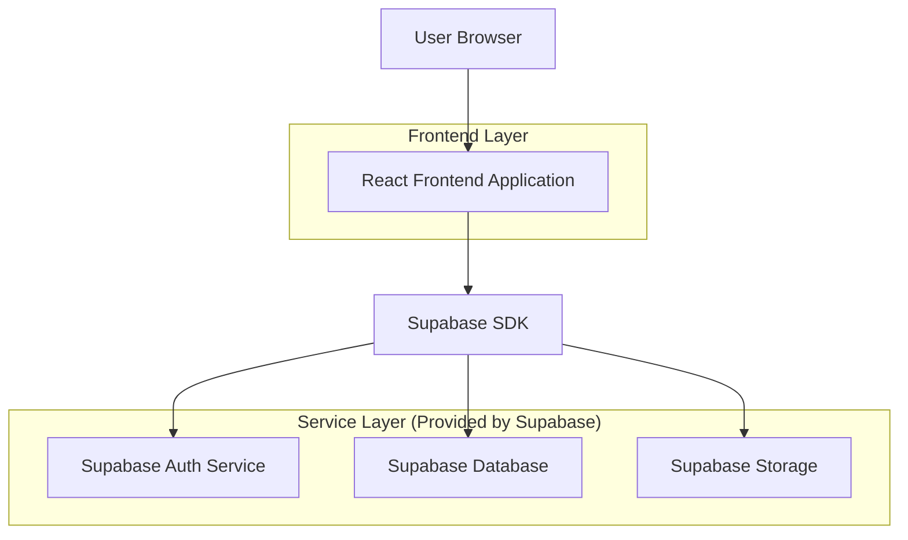
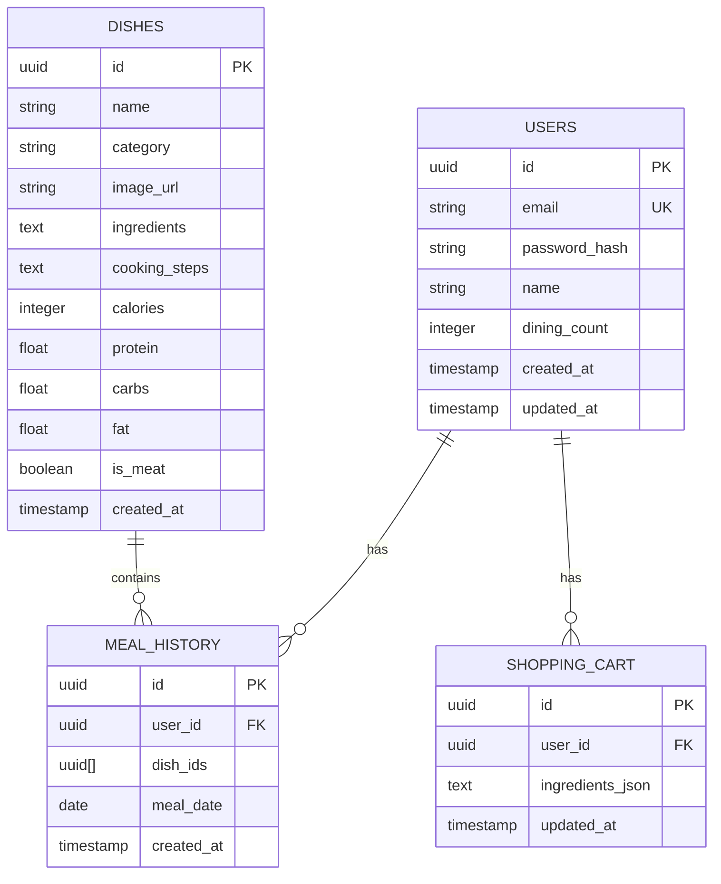

## 1. Architecture design



## 2. Technology Description
- Frontend: React@18 + tailwindcss@3 + vite
- Initialization Tool: vite-init
- Backend: Supabase (Auth + PostgreSQL + Storage)
- State Management: React Context API
- UI Components: HeadlessUI + Custom components

## 3. Route definitions
| Route | Purpose |
|-------|---------|
| /login | Login page for user authentication |
| /register | Registration page for new users |
| / | Home page, displays menu and dish selection |
| /cart | Shopping cart page for ingredient management |
| /calendar | Calendar page to view meal history |
| /analytics | Analytics page for nutrition analysis |
| /settings | Settings page for user preferences |

## 4. API definitions

### 4.1 Core API

**User authentication via Supabase**
```javascript
// Login
const { data, error } = await supabase.auth.signInWithPassword({
  email: userEmail,
  password: userPassword,
})

// Register
const { data, error } = await supabase.auth.signUp({
  email: userEmail,
  password: userPassword,
})
```

**Database operations**
```javascript
// Get all dishes
const { data: dishes, error } = await supabase
  .from('dishes')
  .select('*')

// Get user meal history
const { data: meals, error } = await supabase
  .from('meal_history')
  .select('*')
  .eq('user_id', userId)
  .order('created_at', { ascending: false })

// Save selected dishes
const { data, error } = await supabase
  .from('meal_history')
  .insert([
    { user_id: userId, dish_ids: selectedDishes, meal_date: new Date() }
  ])
```

## 5. Server architecture diagram
Not applicable - using Supabase BaaS solution

## 6. Data model

### 6.1 Data model definition


### 6.2 Data Definition Language

**Users Table**
```sql
-- create table
CREATE TABLE users (
    id UUID PRIMARY KEY DEFAULT gen_random_uuid(),
    email VARCHAR(255) UNIQUE NOT NULL,
    password_hash VARCHAR(255) NOT NULL,
    name VARCHAR(100) NOT NULL,
    dining_count INTEGER DEFAULT 2,
    created_at TIMESTAMP WITH TIME ZONE DEFAULT NOW(),
    updated_at TIMESTAMP WITH TIME ZONE DEFAULT NOW()
);

-- create index
CREATE INDEX idx_users_email ON users(email);
```

**Dishes Table**
```sql
-- create table
CREATE TABLE dishes (
    id UUID PRIMARY KEY DEFAULT gen_random_uuid(),
    name VARCHAR(255) NOT NULL,
    category VARCHAR(50) NOT NULL,
    image_url VARCHAR(500),
    ingredients TEXT NOT NULL,
    cooking_steps TEXT,
    calories INTEGER,
    protein FLOAT,
    carbs FLOAT,
    fat FLOAT,
    is_meat BOOLEAN DEFAULT false,
    created_at TIMESTAMP WITH TIME ZONE DEFAULT NOW()
);

-- create index
CREATE INDEX idx_dishes_category ON dishes(category);
CREATE INDEX idx_dishes_is_meat ON dishes(is_meat);
```

**Meal History Table**
```sql
-- create table
CREATE TABLE meal_history (
    id UUID PRIMARY KEY DEFAULT gen_random_uuid(),
    user_id UUID REFERENCES users(id) ON DELETE CASCADE,
    dish_ids UUID[],
    meal_date DATE DEFAULT CURRENT_DATE,
    created_at TIMESTAMP WITH TIME ZONE DEFAULT NOW()
);

-- create index
CREATE INDEX idx_meal_history_user_id ON meal_history(user_id);
CREATE INDEX idx_meal_history_meal_date ON meal_history(meal_date DESC);
```

**Shopping Cart Table**
```sql
-- create table
CREATE TABLE shopping_cart (
    id UUID PRIMARY KEY DEFAULT gen_random_uuid(),
    user_id UUID REFERENCES users(id) ON DELETE CASCADE,
    ingredients_json TEXT,
    updated_at TIMESTAMP WITH TIME ZONE DEFAULT NOW()
);

-- create index
CREATE INDEX idx_shopping_cart_user_id ON shopping_cart(user_id);
```

**Permissions**
```sql
-- Grant basic read access to anon role
GRANT SELECT ON dishes TO anon;

-- Grant full access to authenticated role
GRANT ALL PRIVILEGES ON dishes TO authenticated;
GRANT ALL PRIVILEGES ON meal_history TO authenticated;
GRANT ALL PRIVILEGES ON shopping_cart TO authenticated;
```